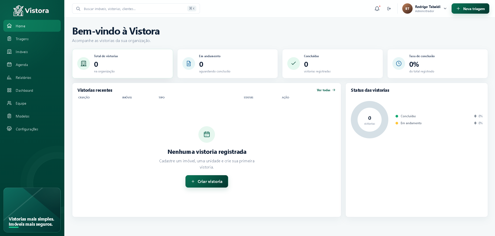
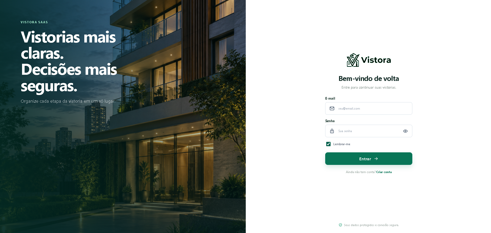
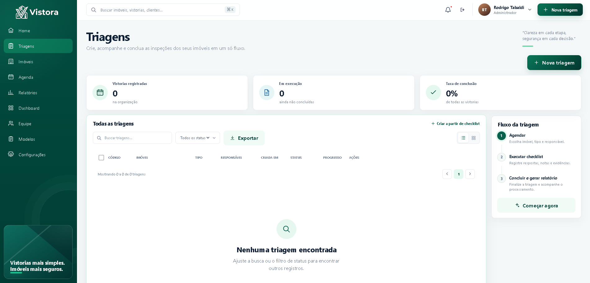
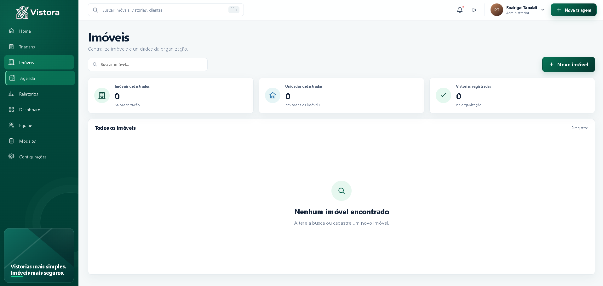
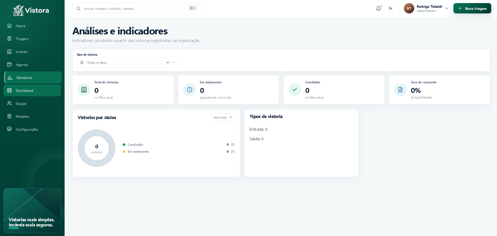
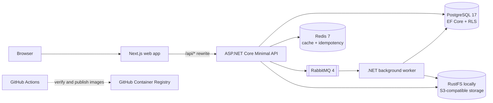
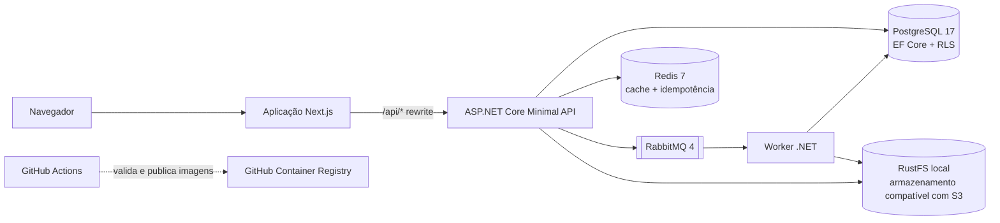

# Vistora

A multi-tenant platform for organizing real estate inspections, reusable checklists, evidence and report workflows.

[English](#english) | [Português](#português)

[](https://dotnet.microsoft.com/)
[](https://nextjs.org/)
[](https://react.dev/)
[](https://www.typescriptlang.org/)
[](https://www.postgresql.org/)
[](https://redis.io/)
[](https://www.rabbitmq.com/)
[](https://docs.docker.com/compose/)



## English

### Overview

Vistora brings property and unit records, inspection checklists, photo evidence and report generation into one organization-scoped workflow. The repository contains a Next.js web app, a .NET API and a background worker, backed by PostgreSQL and supporting services.

### The problem it addresses

Inspection records can become fragmented across forms, photos and follow-up documents. Vistora models each inspection against a property unit, gives teams a structured checklist, and keeps its evidence and report connected to that inspection.

### Key features

- Create organizations and accounts, then manage members with the Admin, Inspector (`Vistoriador`) and Reader (`Leitor`) roles. Invitation links are single-use and expire after seven days; since email delivery is not configured, the app provides a link for manual sharing.
- Register properties and units.
- Build reusable checklist templates with rooms and items.
- Schedule and record move-in or move-out inspections, including responses, notes and photo evidence.
- Compare a move-out inspection with the latest approved move-in inspection for the same unit.
- Generate PDF reports asynchronously through a RabbitMQ queue and .NET worker.
- Record an electronic acceptance with a drawn signature, signer details, timestamp and terms version. This is an auditable application record, not a certified digital signature.
- Approve a completed inspection only after a report and acceptance are present; checklist data cannot be edited after completion.
- View inspection summaries, status indicators, reports and team settings in the web interface.

### Screenshots

The dashboard above is the primary project screenshot. These additional screenshots show the login, inspection, property and analytics screens.

<table>
  <tr>
    <td width="50%" align="center"><strong>Login</strong><br></td>
    <td width="50%" align="center"><strong>Inspections</strong><br></td>
  </tr>
  <tr>
    <td width="50%" align="center"><strong>Properties</strong><br></td>
    <td width="50%" align="center"><strong>Analytics</strong><br></td>
  </tr>
</table>

### Tech stack

| Area | Technologies and components |
| --- | --- |
| **Backend** | C#, .NET 10, ASP.NET Core Minimal APIs, Entity Framework Core 10, Npgsql, PDFsharp/MigraDoc |
| **Frontend** | Next.js 16 App Router, React 19, TypeScript 5 |
| **Database** | PostgreSQL 17, EF Core migrations and PostgreSQL Row-Level Security (RLS) |
| **Infrastructure** | Docker Compose; Redis 7 for the cache abstraction and idempotency store; RabbitMQ 4 for message and report queues; RustFS for local S3-compatible object storage |
| **Tools** | GitHub Actions for CI and container image publishing to GHCR; xUnit; Testcontainers for PostgreSQL integration tests; AWS SDK for S3-compatible storage |

**Routing note:** the Next.js server rewrites `/api/*` to the API. This repository does not configure Nginx, Cloudflare, a load balancer, or production infrastructure.

### Architecture

The backend is organized into Domain, Application and Infrastructure projects, with separate API and Worker hosts. The browser calls the web app; Next.js forwards API paths to ASP.NET Core. The API handles synchronous requests and publishes report jobs. The Worker consumes those jobs, generates PDFs and stores the resulting files.



The local Compose stack includes the frontend, API, Worker, PostgreSQL, Redis, RabbitMQ and RustFS. The existing `docs/Arquitetura.jpeg` is a conceptual sketch; its Cloudflare, Nginx, multiple API and Supabase elements are not configured by the current repository.

### Project structure

```text
.github/workflows/ci.yml                 CI, tests and image publishing
backend/
  Vistora.Domain/                        Entities and domain rules
  Vistora.Application/                   Use cases and application contracts
  Vistora.Infrastructure/                PostgreSQL, Redis, RabbitMQ, S3 and PDF
  Vistora.Api/                           HTTP API and authentication
  Vistora.Worker/                        Background message and report processing
  Vistora.Tests/                         Unit and PostgreSQL integration tests
frontend/                                Next.js app, components and API client
docs/images/                             README screenshots
infra/                                   Infrastructure and PostgreSQL notes
docker-compose.yml                       Local services
.env.example                             Local configuration template
global.json                              .NET SDK selection
```

### Technical decisions

- **Separate domain and infrastructure concerns.** Domain rules and application use cases live apart from database, storage and messaging implementations. HTTP endpoints use ASP.NET Core Minimal APIs; data access uses EF Core rather than a generic repository layer.
- **Enforce tenant isolation at two levels.** EF Core query filters scope records by organization, while PostgreSQL RLS policies enforce the organization boundary in the database. Interceptors set the tenant context on database sessions, and a role guard rejects application connections with RLS-bypassing privileges.
- **Generate reports in the background.** The API records a report job and sends it through RabbitMQ so PDF generation runs in the Worker. Idempotency keys and persisted job state help prevent duplicate work when completion requests are repeated.
- **Keep uploaded files outside relational storage.** An S3-compatible storage interface keeps evidence and reports in object storage; the local Compose environment uses RustFS. Stored file metadata includes SHA-256 hashes that are checked when files are read.
- **Use Redis for cross-request state.** Redis backs request idempotency and the application cache abstraction.
- **Use cookie sessions for the web app.** The API hashes passwords and issues HttpOnly cookies; role policies govern writes. Bearer JWT validation is available when an authority and audience are configured.
- **Keep browser API calls same-origin.** Next.js rewrites `/api/*` to the backend, including the internal Compose service address in the container build.

### Engineering highlights

- Versioned REST endpoints implemented with ASP.NET Core Minimal APIs.
- Multi-tenant data modeling, EF Core migrations, query filters and PostgreSQL RLS.
- Dependency injection and focused use cases for inspection and checklist workflows.
- Cookie authentication, role-based authorization, request rate limiting on registration and login, and a custom guard for cookie-authenticated writes.
- SHA-256 integrity checks and file signature validation for uploaded evidence and signatures.
- Asynchronous report jobs, RabbitMQ retry/failure queues, Redis-backed idempotency and worker health checks.
- Docker multi-stage builds and a GitHub Actions workflow that builds and tests the application, validates Compose, then publishes images to GHCR on successful pushes to `main`.

### API highlights

Business endpoints under `/api/v1` require authentication, except registration, login and invitation acceptance. The `/health` endpoint is public. Write access is further restricted by role policies.

| Endpoints | Purpose |
| --- | --- |
| `POST /api/v1/auth/register`, `POST /api/v1/auth/login`, `POST /api/v1/auth/logout` | Account registration and cookie session management |
| `GET /api/v1/me` | Current user and organization context |
| `GET/POST /api/v1/properties`; `GET/POST /api/v1/properties/{propertyId}/units` | Properties and units |
| `GET /api/v1/checklist-templates`; `GET /api/v1/checklist-templates/manage`; `POST /api/v1/checklist-templates`; `PUT /api/v1/checklist-templates/{templateId}` | Checklist templates |
| `GET/POST /api/v1/inspections`; `POST /api/v1/inspections/from-template` | List and create inspections |
| `GET /api/v1/inspections/{inspectionId}`; `PATCH /api/v1/inspections/{inspectionId}/schedule`; `POST /api/v1/inspections/{inspectionId}/complete`; `PATCH /api/v1/inspections/{inspectionId}/status` | Inspection details, scheduling, report-job creation and status transitions |
| `GET /api/v1/inspections/{inspectionId}/comparison` | Compare related inspections |
| `POST /api/v1/items/{itemId}/evidence`; `GET /api/v1/evidence/{evidenceId}/download` | Upload and download inspection evidence |
| `GET /api/v1/inspections/{inspectionId}/reports`; `GET /api/v1/reports/{reportId}/download` | List and download reports |
| `GET/POST /api/v1/inspections/{inspectionId}/acceptance` | Record or view inspection acceptance |
| `GET /api/v1/team`; `POST /api/v1/team/invitations`; `DELETE /api/v1/team/invitations/{invitationId}`; `POST /api/v1/auth/invitations/accept` | Team members and invitations |
| `GET/PATCH /api/v1/organization`; `GET /health` | Organization settings and service health |

### Database model

PostgreSQL stores organizations, users and accounts, invitations, properties, units, checklist templates, inspections, rooms, items, evidence metadata, reports, report jobs, electronic acceptances and audit events.

Organization-scoped tables carry an organization identifier. EF Core migrations create the schema and RLS policies. Integration tests use PostgreSQL through Testcontainers to exercise tenant isolation and database-role constraints.

### Run locally

The quickest way to run the complete local stack is Docker Compose. In a terminal at the repository root:

```powershell
docker compose up --build
```

Open:

- Web app: [http://localhost:3000](http://localhost:3000)
- API health: [http://localhost:8080/health](http://localhost:8080/health)
- RabbitMQ management: [http://localhost:15672](http://localhost:15672)
- RustFS console: [http://localhost:9001](http://localhost:9001)

Compose provides development defaults. To customize them, copy `.env.example` to `.env` and edit the values locally. The API applies migrations automatically in the Development environment. Use `docker compose down` to stop the stack; named data volumes remain in place.

### Prerequisites

- Docker Engine/Desktop with Docker Compose v2.
- .NET SDK 10.0.400 to build or test the backend outside Docker. The selected SDK is recorded in `global.json`.
- Node.js 24 and npm to install or build the frontend outside Docker.

### Environment variables

The local template is `.env.example`. Compose supplies development defaults; set these variables in `.env` when replacing local services or credentials. No secret values are required in this README.

| Variable group | Purpose |
| --- | --- |
| `POSTGRES_DB`, `POSTGRES_USER`, `POSTGRES_PASSWORD`, `POSTGRES_PORT` | Local PostgreSQL container |
| `REDIS_PORT`, `RABBITMQ_PORT`, `RABBITMQ_MANAGEMENT_PORT`, `RABBITMQ_DEFAULT_USER`, `RABBITMQ_DEFAULT_PASS` | Local Redis and RabbitMQ services |
| `VISTORA_POSTGRES_CONNECTION`, `VISTORA_POSTGRES_MIGRATION_CONNECTION` | Application and development migration connections |
| `VISTORA_REDIS_CONNECTION`, `VISTORA_RABBITMQ_CONNECTION`, `VISTORA_RABBITMQ_QUEUE` | Cache/idempotency and message broker connections |
| `VISTORA_STORAGE_S3_ENDPOINT`, `VISTORA_STORAGE_S3_REGION`, `VISTORA_STORAGE_S3_BUCKET`, `VISTORA_STORAGE_S3_ACCESS_KEY_ID`, `VISTORA_STORAGE_S3_SECRET_ACCESS_KEY`, `VISTORA_S3_ALLOW_INSECURE_LOCAL` | S3-compatible object storage |
| `VISTORA_AUTHORITY`, `VISTORA_AUTH_AUDIENCE` | Optional bearer JWT validation; audience is required when an authority is set |
| `ASPNETCORE_ENVIRONMENT` | API and Worker runtime environment |
| `VISTORA_API_URL` | Frontend Docker build argument for the API rewrite; Compose sets the internal API address |

The migration connection is used automatically only for local Development migrations. For non-local environments, use separately managed credentials and configure a private HTTPS S3 endpoint. Never commit a populated `.env` file or send storage credentials to the browser. The frontend Docker build sets `VISTORA_API_URL` to the internal API service address.

### Install, build and test

Run backend commands from the repository root:

```powershell
dotnet restore backend/Vistora.slnx
dotnet build backend/Vistora.slnx --no-restore --configuration Release
dotnet test backend/Vistora.Tests/Vistora.Tests.csproj --no-restore --configuration Release
```

Build the frontend from its directory. On Windows PowerShell:

```powershell
Set-Location frontend
npm.cmd ci
npm.cmd run build
```

On macOS or Linux, use `npm ci` and `npm run build` in `frontend/`. PostgreSQL integration tests use Testcontainers and require Docker to be available.

### Challenges and learnings

- Tenant isolation needs to follow the request from authenticated organization context through EF Core and into the PostgreSQL session. The integration suite tests this against PostgreSQL because an in-memory provider cannot exercise RLS or connection pooling.
- Completing an inspection starts work that can outlive an HTTP request. The persisted report-job state, RabbitMQ delivery and idempotency handling make that workflow explicit.
- Object storage adds integrity and lifecycle concerns beyond uploading a file. The API validates upload content and checks stored SHA-256 values when serving protected files.
- The retry and failed-message queues exist, but inspecting and replaying failed messages still needs an operational procedure.

### Roadmap

The implemented items below are visible in the API, Worker, tests and web app. The follow-up items are gaps documented by the current project; they do not have committed delivery dates.

**Implemented**

- Organization accounts, role-based access, member invitations and organization settings.
- Property/unit management, checklist templates and move-in/move-out inspections.
- Scheduling, inspection comparison, evidence uploads and electronic acceptance records.
- Asynchronous PDF report generation, local S3-compatible storage and CI image publishing.

**Next steps identified**

- Configure email delivery for invitations and account recovery.
- Document and operate inspection/replay for failed messages.
- Decide how WebP evidence should appear in generated PDFs; current PDF output embeds JPEG/PNG images, while WebP remains available through the application.
- Select a production hosting target and define deployment, backup, availability and performance procedures.

### Project status

**In development.** The repository includes a runnable local Compose stack and CI for backend build/tests, frontend build and Compose validation. Successful pushes to `main` publish API, Worker and frontend images to GHCR; the workflow does not deploy them. Production operations and availability have not been validated.

### Author

**Rodrigo Tabaldi**

Software Engineering student focused on Backend Development, .NET and Full Stack applications.

GitHub: [Vistora repository](https://github.com/RodrigoTabaldi/VistoraSaas)

## Português

### Visão geral

A Vistora reúne imóveis e unidades, checklists, evidências fotográficas e geração de laudos em um fluxo por organização. O repositório inclui uma aplicação web em Next.js, uma API e um Worker em .NET, com PostgreSQL e serviços de apoio.

### Problema que resolve

Registros de vistoria podem ficar espalhados entre formulários, fotos e documentos de acompanhamento. A Vistora associa cada vistoria a uma unidade, organiza as respostas em checklists e mantém evidências e laudos ligados ao mesmo registro.

### Funcionalidades principais

- Criar organizações e contas e gerenciar membros com os perfis Admin, Vistoriador e Leitor.
- Gerar convites de uso único com validade de sete dias. Como o envio de e-mails não está configurado, a aplicação disponibiliza o link para compartilhamento manual.
- Cadastrar imóveis e unidades.
- Criar modelos reutilizáveis de checklist com ambientes e itens.
- Agendar e registrar vistorias de entrada ou saída, com respostas, observações e evidências fotográficas.
- Comparar uma vistoria de saída com a vistoria de entrada aprovada mais recente da mesma unidade.
- Gerar laudos em PDF de forma assíncrona por meio de uma fila RabbitMQ e um Worker .NET.
- Registrar aceite eletrônico com assinatura desenhada, dados do signatário, data e versão dos termos. É um registro auditável da aplicação, não uma assinatura digital certificada.
- Aprovar uma vistoria concluída somente após a geração de um laudo e o registro do aceite; os dados do checklist deixam de ser editáveis após a conclusão.
- Consultar resumos, indicadores de status, laudos e configurações da equipe na interface web.

### Capturas de tela

O dashboard acima é a imagem principal do projeto. As capturas de login, vistorias, imóveis e análises estão na seção [Screenshots](#screenshots).

### Stack tecnológica

| Área | Tecnologias e componentes |
| --- | --- |
| **Backend** | C#, .NET 10, ASP.NET Core Minimal APIs, Entity Framework Core 10, Npgsql, PDFsharp/MigraDoc |
| **Frontend** | Next.js 16 App Router, React 19, TypeScript 5 |
| **Banco de dados** | PostgreSQL 17, migrations do EF Core e Row-Level Security (RLS) do PostgreSQL |
| **Infraestrutura** | Docker Compose; Redis 7 para cache e idempotência; RabbitMQ 4 para filas de mensagens e laudos; RustFS para armazenamento local compatível com S3 |
| **Ferramentas** | GitHub Actions para CI e publicação de imagens no GHCR; xUnit; Testcontainers para testes de integração com PostgreSQL; AWS SDK para armazenamento compatível com S3 |

**Roteamento:** o servidor Next.js redireciona `/api/*` para a API. Este repositório não configura Nginx, Cloudflare, balanceador de carga ou infraestrutura de produção.

### Arquitetura

O backend separa os projetos Domain, Application e Infrastructure, com hosts distintos para API e Worker. O navegador acessa a aplicação web; o Next.js encaminha as rotas da API para ASP.NET Core. A API atende requisições e publica jobs de laudo. O Worker consome esses jobs, gera PDFs e armazena os arquivos resultantes.



O Compose local inicia frontend, API, Worker, PostgreSQL, Redis, RabbitMQ e RustFS. O arquivo existente `docs/Arquitetura.jpeg` é um esboço conceitual; os componentes Cloudflare, Nginx, múltiplas APIs e Supabase nele desenhados não estão configurados no repositório atual.

### Estrutura do projeto

```text
.github/workflows/ci.yml                 CI, testes e publicação de imagens
backend/
  Vistora.Domain/                        Entidades e regras de domínio
  Vistora.Application/                   Casos de uso e contratos
  Vistora.Infrastructure/                PostgreSQL, Redis, RabbitMQ, S3 e PDF
  Vistora.Api/                           API HTTP e autenticação
  Vistora.Worker/                        Processamento de mensagens e laudos
  Vistora.Tests/                         Testes unitários e de integração PostgreSQL
frontend/                                Aplicação Next.js, componentes e cliente de API
docs/images/                             Capturas usadas neste README
infra/                                   Notas de infraestrutura e PostgreSQL
docker-compose.yml                       Serviços locais
.env.example                             Modelo de configuração local
global.json                              Seleção do SDK .NET
```

### Decisões técnicas

- **Separação entre domínio e infraestrutura.** Regras de domínio e casos de uso ficam separados das implementações de banco, armazenamento e mensageria. A API usa Minimal APIs do ASP.NET Core; o acesso a dados usa EF Core diretamente, sem uma camada genérica de repositórios.
- **Isolamento por organização em duas camadas.** Filtros do EF Core limitam registros por organização, enquanto políticas RLS aplicam essa separação no PostgreSQL. Interceptors definem o contexto de organização na sessão do banco, e uma verificação impede conexões da aplicação com privilégios que contornem o RLS.
- **Geração de laudos em segundo plano.** A API registra um job e o publica no RabbitMQ para que o Worker gere o PDF. Chaves de idempotência e o estado persistido do job ajudam a evitar trabalho duplicado quando a conclusão é solicitada novamente.
- **Arquivos fora do banco relacional.** Uma interface de armazenamento compatível com S3 mantém fotos e laudos em armazenamento de objetos; o Compose local usa RustFS. Os metadados incluem hashes SHA-256, verificados durante a leitura.
- **Redis para estado compartilhado entre requisições.** O Redis atende a idempotência e à abstração de cache da aplicação.
- **Sessões por cookie para a aplicação web.** A API armazena hashes de senhas e emite cookies HttpOnly; políticas por perfil controlam as operações de escrita. A validação de JWT Bearer pode ser habilitada com autoridade e público configurados.
- **Chamadas de API same-origin no navegador.** O Next.js redireciona `/api/*` ao backend, inclusive ao endereço interno do serviço no Compose.

### Destaques de engenharia

- Endpoints REST versionados com ASP.NET Core Minimal APIs.
- Modelagem multi-tenant, migrations do EF Core, filtros por organização e RLS no PostgreSQL.
- Injeção de dependências e casos de uso específicos para fluxos de vistoria e checklist.
- Autenticação por cookie, autorização por perfil, limitação de requisições no cadastro e login e proteção própria para escritas autenticadas por cookie.
- Verificação de integridade SHA-256 e validação de assinatura do arquivo para evidências e assinaturas enviadas.
- Jobs de laudo assíncronos, filas de retry e falha no RabbitMQ, idempotência com Redis e health checks do Worker.
- Imagens Docker com build em múltiplas etapas e workflow do GitHub Actions que compila e testa a aplicação, valida o Compose e publica imagens no GHCR após pushes bem-sucedidos em `main`.

### Principais endpoints da API

As rotas de negócio sob `/api/v1` exigem autenticação, exceto cadastro, login e aceite de convite. A rota `/health` é pública. As operações de escrita também são limitadas pelas políticas de perfil.

| Endpoints | Finalidade |
| --- | --- |
| `POST /api/v1/auth/register`, `POST /api/v1/auth/login`, `POST /api/v1/auth/logout` | Cadastro e gerenciamento da sessão por cookie |
| `GET /api/v1/me` | Usuário atual e contexto da organização |
| `GET/POST /api/v1/properties`; `GET/POST /api/v1/properties/{propertyId}/units` | Imóveis e unidades |
| `GET /api/v1/checklist-templates`; `GET /api/v1/checklist-templates/manage`; `POST /api/v1/checklist-templates`; `PUT /api/v1/checklist-templates/{templateId}` | Modelos de checklist |
| `GET/POST /api/v1/inspections`; `POST /api/v1/inspections/from-template` | Listagem e criação de vistorias |
| `GET /api/v1/inspections/{inspectionId}`; `PATCH /api/v1/inspections/{inspectionId}/schedule`; `POST /api/v1/inspections/{inspectionId}/complete`; `PATCH /api/v1/inspections/{inspectionId}/status` | Detalhes, agendamento, criação do job de laudo e transições de status |
| `GET /api/v1/inspections/{inspectionId}/comparison` | Comparação entre vistorias relacionadas |
| `POST /api/v1/items/{itemId}/evidence`; `GET /api/v1/evidence/{evidenceId}/download` | Envio e download de evidências |
| `GET /api/v1/inspections/{inspectionId}/reports`; `GET /api/v1/reports/{reportId}/download` | Listagem e download de laudos |
| `GET/POST /api/v1/inspections/{inspectionId}/acceptance` | Registrar ou consultar aceite da vistoria |
| `GET /api/v1/team`; `POST /api/v1/team/invitations`; `DELETE /api/v1/team/invitations/{invitationId}`; `POST /api/v1/auth/invitations/accept` | Membros e convites |
| `GET/PATCH /api/v1/organization`; `GET /health` | Configurações da organização e saúde dos serviços |

### Banco de dados

O PostgreSQL armazena organizações, usuários e contas, convites, imóveis, unidades, modelos de checklist, vistorias, ambientes, itens, metadados de evidências, laudos, jobs de laudo, aceites eletrônicos e eventos de auditoria.

As tabelas multi-tenant incluem o identificador da organização. Migrations do EF Core criam o esquema e as políticas RLS. Os testes de integração usam PostgreSQL por meio do Testcontainers para exercitar isolamento entre organizações e privilégios da role de aplicação.

### Executar localmente

A forma mais direta de iniciar a stack local completa é com Docker Compose. No terminal, a partir da raiz do repositório:

```powershell
docker compose up --build
```

Acesse:

- Aplicação web: [http://localhost:3000](http://localhost:3000)
- Saúde da API: [http://localhost:8080/health](http://localhost:8080/health)
- Gerenciamento do RabbitMQ: [http://localhost:15672](http://localhost:15672)
- Console do RustFS: [http://localhost:9001](http://localhost:9001)

O Compose fornece valores padrão de desenvolvimento. Para personalizá-los, copie `.env.example` para `.env` e edite os valores localmente. No ambiente Development, a API aplica as migrations automaticamente. Use `docker compose down` para encerrar os serviços; os volumes nomeados de dados são preservados.

### Pré-requisitos

- Docker Engine/Desktop com Docker Compose v2.
- .NET SDK 10.0.400 para compilar ou testar o backend fora do Docker. A versão selecionada está registrada em `global.json`.
- Node.js 24 e npm para instalar dependências ou compilar o frontend fora do Docker.

### Variáveis de ambiente

O modelo local está em `.env.example`. O Compose fornece valores padrão para desenvolvimento; defina estas variáveis em `.env` ao substituir serviços locais ou credenciais. Este README não contém valores de secrets.

| Grupo de variáveis | Finalidade |
| --- | --- |
| `POSTGRES_DB`, `POSTGRES_USER`, `POSTGRES_PASSWORD`, `POSTGRES_PORT` | Container local do PostgreSQL |
| `REDIS_PORT`, `RABBITMQ_PORT`, `RABBITMQ_MANAGEMENT_PORT`, `RABBITMQ_DEFAULT_USER`, `RABBITMQ_DEFAULT_PASS` | Serviços locais Redis e RabbitMQ |
| `VISTORA_POSTGRES_CONNECTION`, `VISTORA_POSTGRES_MIGRATION_CONNECTION` | Conexões da aplicação e de migrations no ambiente Development |
| `VISTORA_REDIS_CONNECTION`, `VISTORA_RABBITMQ_CONNECTION`, `VISTORA_RABBITMQ_QUEUE` | Conexões de cache/idempotência e mensageria |
| `VISTORA_STORAGE_S3_ENDPOINT`, `VISTORA_STORAGE_S3_REGION`, `VISTORA_STORAGE_S3_BUCKET`, `VISTORA_STORAGE_S3_ACCESS_KEY_ID`, `VISTORA_STORAGE_S3_SECRET_ACCESS_KEY`, `VISTORA_S3_ALLOW_INSECURE_LOCAL` | Armazenamento compatível com S3 |
| `VISTORA_AUTHORITY`, `VISTORA_AUTH_AUDIENCE` | Validação opcional de JWT Bearer; o público é obrigatório quando há uma autoridade |
| `ASPNETCORE_ENVIRONMENT` | Ambiente de execução da API e do Worker |
| `VISTORA_API_URL` | Argumento de build Docker do frontend para o redirecionamento à API; o Compose define o endereço interno |

A conexão de migrations é usada automaticamente apenas para migrations locais em Development. Para ambientes não locais, use credenciais administradas separadamente e configure um endpoint S3 privado com HTTPS. Não versione um arquivo `.env` preenchido nem envie credenciais de armazenamento ao navegador. O build Docker do frontend define `VISTORA_API_URL` com o endereço interno da API.

### Instalação, build e testes

Execute os comandos do backend a partir da raiz:

```powershell
dotnet restore backend/Vistora.slnx
dotnet build backend/Vistora.slnx --no-restore --configuration Release
dotnet test backend/Vistora.Tests/Vistora.Tests.csproj --no-restore --configuration Release
```

Compile o frontend a partir da pasta correspondente. No Windows PowerShell:

```powershell
Set-Location frontend
npm.cmd ci
npm.cmd run build
```

No macOS ou Linux, use `npm ci` e `npm run build` dentro de `frontend/`. Os testes de integração PostgreSQL usam Testcontainers e precisam do Docker disponível.

### Desafios e aprendizados

- O isolamento por organização precisa acompanhar a requisição desde o contexto autenticado até o EF Core e a sessão PostgreSQL. A suíte de integração valida esse comportamento com PostgreSQL, pois um provider em memória não exercita RLS ou pooling de conexões.
- A conclusão de uma vistoria inicia um processamento que pode durar mais que uma requisição HTTP. O estado persistido do job, a entrega RabbitMQ e a idempotência deixam esse fluxo explícito.
- O armazenamento de arquivos traz preocupações de integridade além do upload. A API valida o conteúdo recebido e confere hashes SHA-256 ao servir arquivos protegidos.
- As filas de retry e falha existem, mas ainda falta um procedimento operacional para inspecionar e reprocessar mensagens com falha.

### Roadmap

Os itens implementados abaixo podem ser verificados na API, no Worker, nos testes e na aplicação web. Os próximos passos correspondem a lacunas documentadas no projeto atual, sem datas de entrega comprometidas.

**Concluído**

- Contas por organização, autorização por perfil, convites de membros e configurações da organização.
- Gestão de imóveis/unidades, modelos de checklist e vistorias de entrada/saída.
- Agendamento, comparação de vistorias, envio de evidências e registros de aceite eletrônico.
- Geração assíncrona de laudos PDF, armazenamento local compatível com S3 e publicação de imagens pela CI.

**Próximos passos identificados**

- Configurar envio de e-mails para convites e recuperação de conta.
- Documentar um procedimento operacional para inspecionar e reprocessar mensagens com falha.
- Definir como evidências WebP devem aparecer nos PDFs; a geração atual incorpora imagens JPEG/PNG, enquanto WebP continua acessível pela aplicação.
- Escolher o destino de produção e definir procedimentos de implantação, backup, disponibilidade e desempenho.

### Status do projeto

**Em desenvolvimento.** O repositório inclui uma stack local executável via Compose e CI para build/testes do backend, build do frontend e validação do Compose. Pushes bem-sucedidos em `main` publicam imagens da API, do Worker e do frontend no GHCR; o workflow não faz deploy. As operações de produção e a disponibilidade ainda não foram validadas.

### Autor

**Rodrigo Tabaldi**

Estudante de Engenharia de Software com foco em desenvolvimento Backend, .NET e aplicações Full Stack.

GitHub: [Repositório Vistora](https://github.com/RodrigoTabaldi/VistoraSaas)
